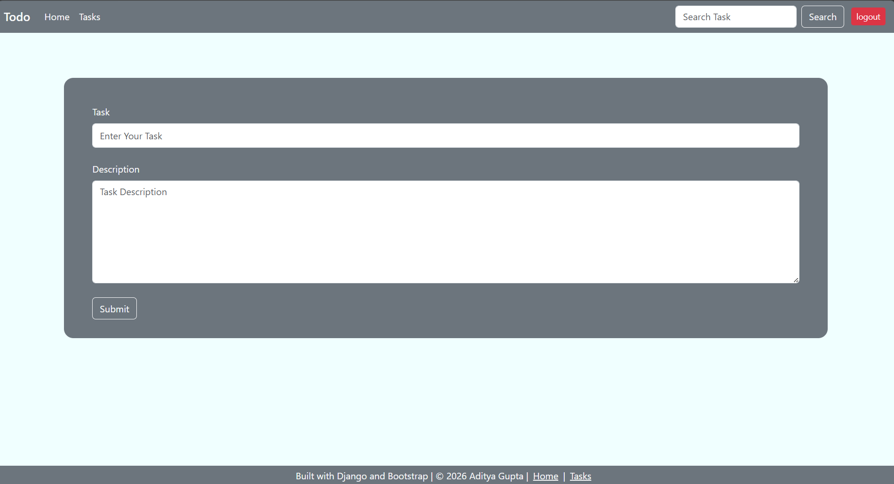
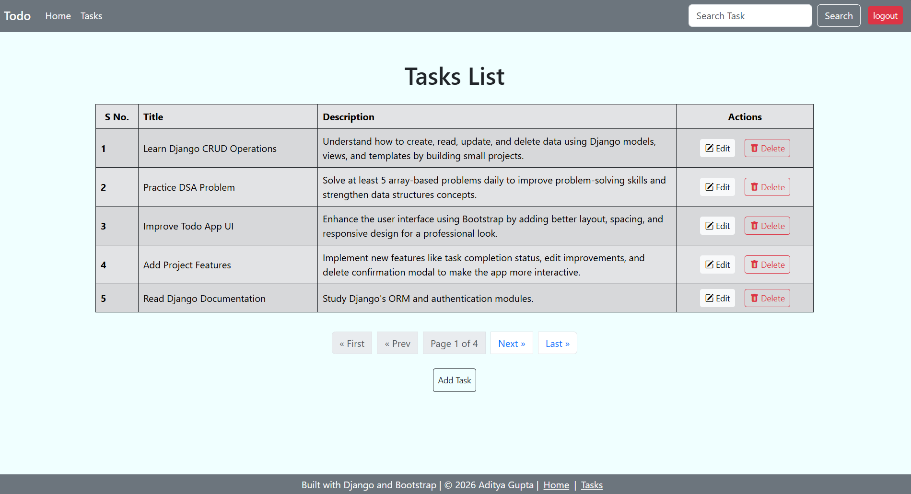
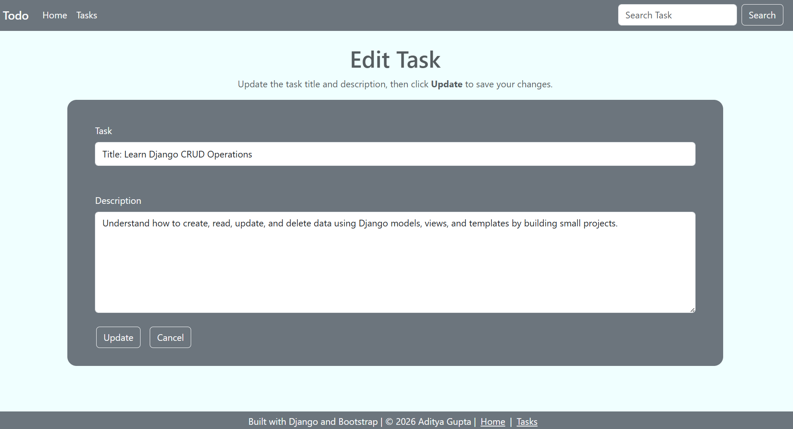
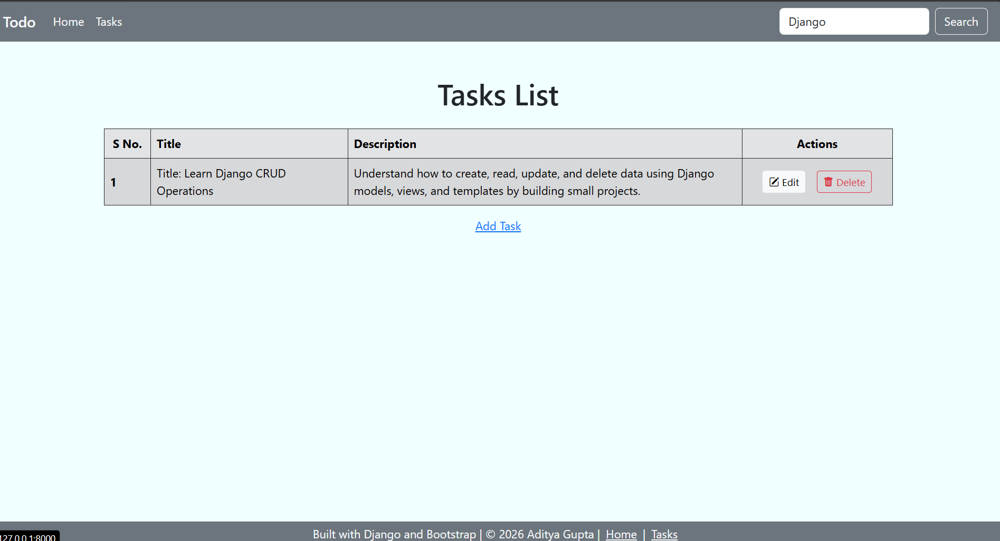
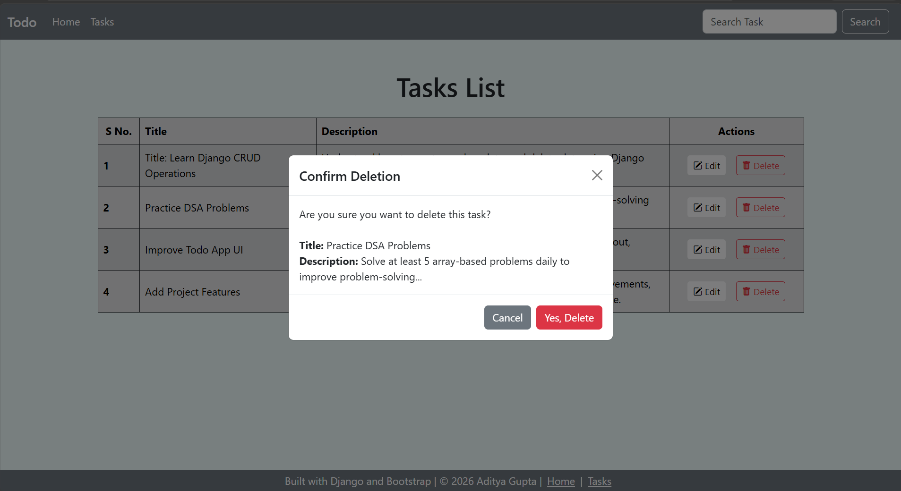

# Django Todo List

A web-based Todo List application developed using Django and Bootstrap. The application allows users to create, view, update, delete, and search tasks through a clean and responsive interface. The project demonstrates the implementation of Django's MVC architecture, CRUD operations, URL routing, template rendering, ORM, and frontend integration with Bootstrap.

---

# Features

* Create new tasks with a title and description
* View all tasks in a structured table
* Update existing tasks
* Delete tasks with a confirmation prompt
* Search tasks by title and description
* Display a warning when no matching tasks are found
* Responsive user interface built with Bootstrap 5
* Navigation bar for quick access to pages
* Clean and user-friendly layout

---

# Screenshots

## Home Page

The home page allows users to create a new task by entering a title and description.



---

## Tasks Page

Displays all tasks in a responsive table with Edit and Delete actions.



---

## Edit Task

The edit page automatically loads the selected task, allowing users to update its title and description.



---

## Search Functionality

Search tasks by title or description using the navigation bar.



---

## Delete Confirmation

A confirmation dialog is displayed before permanently deleting a task.


---


# Technologies Used

* Python
* Django
* HTML5
* CSS3
* Bootstrap 5
* SQLite3

---

# Project Structure

```
django_todo_app/
│
├── manage.py
├── requirements.txt
├── README.md
│
├── Todolist/
│   ├── settings.py
│   ├── urls.py
│   ├── asgi.py
│   └── wsgi.py
│
├── home/
│   ├── migrations/
│   ├── admin.py
│   ├── apps.py
│   ├── models.py
│   ├── urls.py
│   ├── views.py
│   └── tests.py
│
├── templates/
│   ├── base.html
│   ├── home.html
│   ├── tasks.html
│   └── edittask.html
│
├── static/
│
└── .gitignore
```

---

# Application Workflow

### Home Page

* Enter a task title.
* Enter the task description.
* Submit the form to create a new task.

### Tasks Page

Displays all tasks with:

* Serial Number
* Task Title
* Task Description
* Edit Action
* Delete Action

### Edit Task

* Opens a dedicated edit page.
* Automatically populates the existing task information.
* Saves the updated task details.

### Delete Task

* Displays a confirmation prompt before deletion.
* Deletes the selected task after confirmation.

### Search

* Search tasks from the navigation bar.
* Performs case-insensitive searches on both the task title and description.
* Displays a warning message if no matching tasks are found.

---

# Django Concepts Demonstrated

* Django Models
* Django Views
* URL Routing
* Template Inheritance
* Template Rendering
* Django ORM
* CRUD Operations
* Query Filtering using `Q` Objects
* CSRF Protection
* Static Files
* Bootstrap Integration

---

# Database

The application uses SQLite as the default database.

Current model:

```python
class Task(models.Model):
    tasktitle = models.CharField(max_length=30)
    taskdesc = models.TextField()
    timecreated = models.DateTimeField(auto_now_add=True)

    def __str__(self):
        return self.tasktitle
```

---

# Requirements

Install all required packages using:

```bash
pip install -r requirements.txt
```

---

# License

This project is intended for educational and portfolio purposes.
